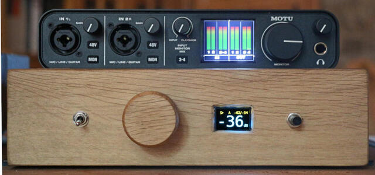

# What's here

Basically, instructions on components (hardware + software) used for a DIY
multichannel DSP (based on the excellent
[CamillaDSP](https://github.com/HEnquist/camilladsp) project), with dynamic
master volume, display, and extras such as waking-up a subwoofer with an
inaudible tone, bluetooth streamer, etc.

This project is pretty generic and should work on different hardware than what
I've used. I'm publishing my notes so that people struggling with specific
components that aren't well documented (eg. multichannel alsa) can see how it
works. Or, maybe someone will replicate the whole thing :)

(More info on my own CamillaDSP setup in [this section](#my-camilladsp-setup)).

Table of content:

- [Why](#why)
- [Components / features:](#components-features)
- Installation / Setup
  - [Overview](#overview)
  - [Alsa setup](#alsa-setup)
  - [Capture setup - CamillaDSP](#capture-setup---camilladsp)
  - [Config 0: LMS/squeezelite](#config-0-lmssqueezelite)
  - [Config 1: pipewire/jacktrip](#config-1-pipewirejacktrip)
- [Camilla DSP GUI (optional)](#camilla-dsp-gui-optional)
- [My CamillaDSP setup](#my-camilladsp-setup)
- [Python scripts that handle the display, buttons, rotary
  encoder,
  etc.](#python-scripts-that-handle-the-display-buttons-rotary-encoder-etc.)
- [Bluetooth streamer](#bluetooth-streamer)


## Why

I have a pair of Kef LS50s passive loudspeakers that are great (IMO) but I
always found the bass lacking so I recently decided to buy a subwoofer. However
my integrated stereo amp doesn't have an LFE output and the subwoofer I bought
(Kef Kube12b) only has inputs so there's no way to send frequencies above the
sub's crossover to the mains (yeah I know - it's debatable, some people prefer
"let" their mains add whatever bass they can produce but I'm of the opinion that
it shouldn't be done. YMMW). That + wanting to EQ the whole setup (eg. with
[REW](https://www.roomeqwizard.com/)) made me look into available DSP solutions.

Research showed that there were either >1000 USD gear (the usual audiophile BS),
noisy gear (miniDSP 2x4), OK-ish gear (miniDSP 2x4 HD), or somewhere in the
"middle" the miniDSP Flex. The latter looked like a great option, albeit a bit
expensive; however a
[post](https://www.audiosciencereview.com/forum/index.php?threads/rpi4-camilladsp-tutorial.29656/)
on ASR about a rpi4 + CamillDSP + Motu M4 4 channel interface piqued my
curiosity so I decided to go the "DIY" way given that I already had some gear at
hand (I "only" bought the M4). I ended up spending waaaay more time than
planned; time-wise it's much more expensive than simply buying the Flex - but it
was definitely interesting and I learned quite a few things.

So - the project below is what I ended up with, I'm happy with the result, it
works perfectly and trumps the miniDSP Flex in terms of features. Hopefully my
notes will help someone - as some things initially looked difficult but ended up
taking only a bit of time, while other things looked easy but took a lot of time
to implement/debug.

 

Please note that I don't have much time nowadays - I'd be happy to help when
possible (post an issue) but please don't take it personally if I don't reply
for quite a bit of time.


## Components / features:

Hardware:

- an old mini-ITX case, with a custom-made wood panel
- ~1W power consumption with a [Rockpi-S](https://wiki.radxa.com/RockpiS) (but
  could have been a rpi3/4 or whatever run-of-the-mill embedded platform).
- [Motu M4](https://motu.com/m4) sound interface 4 channels (or USB) in / 4
  channels out; this interface got [pretty good
  measurements/reviews](https://www.audiosciencereview.com/forum/index.php?threads/motu-m4-audio-interface-review.15757/)
  on ASR. But TBH, I don't think I could hear the difference of DACs with worse
  measurements, so any decent interface should work.
- Rotary encoder (on GPIO inputs) with software debouncing for the master volume
  (note: the rockpi-s has an analog-in input that could be used with a
  potentiometer instead - tested to work OK with the latest armbian release +
  updates).
- Buttons (on GPIO inputs) for pause/mute and switching CamillaDSP configs
- small i2c [oled
  display](https://www.winstar.com.tw/products/oled-module/graphic-oled-display/dual-color-oled.html)
  that shows the volume, mute status, player status, RMS/peak dB, and
  CamillaDSP config index.
- a custom breakout board, mostly with resistors to protect gpio inputs and a
  few capacitors for filtering. (one could do without that board)
- a "master" switch to switch 5V and 220V (via relay+fuse) to the amp/sub/M4
  (also not needed per se. - just provides convenience of turning off/on
  everything at once).
- a [Bluetooth
  dongle](https://www.tp-link.com/us/home-networking/usb-adapter/ub500/) for
  streaming LDAC audio via BT (that's a standalone setup, not related to
  anything above)

Software:

- [armbian](https://www.armbian.com/) (but any decent distro should do)
- [CamillaDSP](https://github.com/HEnquist/camilladsp)
- [pipewire/wireplumber](https://pipewire.org/) for the Bluetooth setup
- pipewire/wireplumber/[jacktrip](https://ccrma.stanford.edu/software/jacktrip/)
  for playing audio sent from other devices
- and finally a few custom python programs to manage the GPIOs, CamillaDSP,
  automatically play an inaudible tone to "wake-up" the subwoofer, display
  the volume/levels/... on the i2c display, etc.


## Installation / Setup

### Overview

CamillaDSP captures from [alsa loopback
devices](https://www.alsa-project.org/main/index.php/Matrix:Module-aloop) and
plays back on the Motu M4

- output: mono subwoofer on channel 0, channel 1 unused (potentially for 2nd
  subwoofer), mains L/R on channels 3/4 - that way bass can be controlled by the
  M4's volume knob, which works only for channels 0 & 1.

- filters: high/low pass filters, EQ filters, dynamic volume, DC protection,
  etc.

- config #0: squeezelite plays on alsa loopback #0 first two channels; LFE tone
  on the 3rd channel (see below). CamillaDSP captures from alsa loopback 0's
first 3 channels.

- config #1: jacktrip (through pipewire) plays on alsa loopback #1's first two
  channels. LFE tone on the 3rd channel. CamillaDSP captures from alsa loopback
  #1's first 3 channels. That config allows me to send audio from other devices
  without messing with loopback #0.

In both configs above: an inaudible low frequency tone plays at regular
intervals on alsa loopback #0's 3rd channel to keep the subwoofer turned on

- Bluetooth streamer with LDAC audio (standalone setup/config, independent from
  CamillaDSP/M4/...). In my case, I'm streaming to a [Qudelix
  5K](https://www.qudelix.com/products/qudelix-5k-dac-amp)  (headphone EQ is
  done on the Qudelix but I'll probably try moving it to a dedicated CamillaDSP
  instance to test more complex EQ and crossfeed configurations).


### Alsa setup

Two alsa loop devices are used (see note #2 in [Config 1:
pipewire/jacktrip](#config-1-pipewirejacktrip)).

As root:

```
echo "snd-aloop.conf" > /etc/modules-load.d/snd-aloop.conf
# use two loopbacks - one for LMS/squeezelite, one for pipewire/jack
echo "options snd-aloop index=0,1 enable=1,1 pcm_substreams=1,1 " \
    "id=\"Loopback0\",\"Loopback1\" > /etc/modprobe.d/snd-aloop.conf
```

Since stereo content is played on the first two channels of alsa loopback and an
intermittent LFE tone on the 3rd, a bit more work is required to "present" the
loopback device to playing apps as individual, standalone PCMs (as playing to
the loopback directly from both apps won't work). Note: CamillaDSP captures the
whole loopback so no need for any custom configuration on the "capture side".

Most examples on the net make use of alsa's `route` plugin - however this is CPU
intensive compared to `dshare` and not a good choice for embedded hardware. See
`/etc/asound.conf` for a working configuration.

Useful `dshare` resources:

- [Audio multi-channel routing and mixing using alsalib](https://bootlin.com/blog/audio-multi-channel-routing-and-mixing-using-alsalib/)
- [Alsa doc / Dshare](https://alsa.opensrc.org/Dshare)

Note: we're using alsa `hw` devices so the sample rate, format and number of
channels of the various producers/consumers **must** match. Alsa's
[`snd-aloop` doc](https://www.alsa-project.org/main/index.php/Matrix:Module-aloop)
also mentions this property:

> The first application opening one device, will force the second application,
> trying to open the other device, to use its established parameters

That means that the *order* in which applications are started is important so
you can't rely on - say - one of the applications to adapt to the other one's
parameters if you're not 100% sure that the 2nd app is always started after the
1st. That's why it's less fragile to hardcode the parameters everywhere.


### Capture setup - CamillaDSP

CamillaDSP startup "sequence" overview:

- a udev event is triggered when the M4 is powered on
- udev creates a systemd service from the `camilladsp@.service` template, which
  is bound to the device - ie. systemd stops CamillaDSP when the device
  disappears/is unplugged.
- the systemd service execs a shell helper that builds options for CamillaDSP
  which then execs CamillaDSP (as user `io`)


[Download camillaDSP](https://github.com/HEnquist/camilladsp/releases)
(linux-aarch64)

as root:

```
useradd -m io
usermod -aG audio io

```

as `io` user:

```
mkdir -p ~/camilladsp/{coeffs,configs}
tar -xvf /tmp/camilladsp-linux-aarch64.tar.gz -C ~/camilladsp/
```

Files - see:

```
/etc/udev/rules.d/90-camilladsp.rules
/etc/systemd/system/camilladsp@.service
/usr/local/bin/camilladsp_systemd_wrapper
```

and `/home/io/camilladsp/configs/`


### Config 0: LMS/squeezelite

- [squeezelite](squeezelite.md) plays on `pcm.Loopback0_0_c01` (alsa loopback
  0,0 first two channels - as defined in `/etc/asound.conf`)
- [`lfe_tone.py`](pymedia.md) plays an intermittent low frequency tone on
  `pcm.Loopback0_0_c2` to wake-up the subwoofer / prevent it from going into
  standby.
- CamillaDSP capturing from alsa loopback 0,1

Obviously something other than squeezelite could be used - it's pretty easy to
adapt the setup below to any other player.

Squeezelite startup "sequence" overview:

- a udev event is triggered when the `snd-aloop` module is loaded
- a udev rule creates a systemd service from the `squeezelite@.service`
  template, which is bound to the underlying device (ie. systemd stops
  squeezelite when the device disappears/is unplugged)
- the systemd service execs a shell helper that builds options for squeezelite,
  which then execs squeezelite (as user `io`)

Note - the setup above could be replaced by a standalone systemd service since
we're sure that `snd-aloop` is loaded, but the udev/systemd template approach is
more flexible: it's easy to add more players/squeezelite instances when plugging
additional USB DACs (this udev/service template is something I copied from a
former project and has proved to be working really well over the years).

Installation:

Download the [aarch64
version](https://sourceforge.net/projects/lmsclients/files/squeezelite/linux/)
non-pulse version of squeezelite and copy to `/usr/local/bin/squeezelite`

Install dependencies - as root:

```
apt install libasound2 libmad0 libfaad2 libmpg123-0 libvorbisidec1 libopusfile0
```

Files - see:

```
/etc/udev/rules.d/90-dac.rules
/etc/systemd/system/squeezelite\@.service
/usr/local/bin/squeezelite_systemd
```


### Config 1: pipewire/jacktrip

- `jacktrip` (through pipewire's jack server) plays on `pcm.Loopback1_0_c01`
  (alsa loopback 0,0 first two channels - as defined in `/etc/asound.conf`) with
  a 24000 Hz sampling rate (to decrease bandwidth requirements because jacktrip
  doesn't have compression and my wi-fi isn't great).
- [`lfe_tone.py`](pymedia.md) plays an intermittent low frequency tone on
  `pcm.Loopback0_0_c2` to wake-up the subwoofer / prevent it from going into
  standby.
- CamillaDSP captures from alsa loopback 1,1

Note #1 - why jacktrip: because that's the only option that worked for me:
jack's net 1 doesn't work because the "server" is actually the client and for
various reasons I can't allow a remote device to connect to my laptop. Jack's
net 2 is multicast only (which doesn't work with VMs in Qubes OS laptop).
Pulseaudio (or pipewire)'s simple TCP protocol has way too much latency (and tcp
over tcp is a bad idea anyway). A RTP sink may have worked but debian didn't
package them for pipewire and I didn't feel like going into compiling custom
packages. So - jacktrip it is.

Note #2 - why two alsa loopback devices: because it's much easier, given
squeezelite and jacktrip's different sample rates (44100Hz vs. 24000Hz), the
requirement of matching exactly alsa's parameters, making sure that only one app
plays back, etc.

I chose to use a different user for pipewire/jacktrip - the idea was to avoid
messing up my working setup with squeezelite, but you could setup everything as
user `io` instead.

```
useradd -m pw
usermod -G audio pw
loginctl enable-linger pw
```

Follow these [instructions](pipewire_debian_testing.md) to install a recent
version of pipewire and wireplumber as at the time of writing the versions
packaged are prehistoric.

config files:

```
/home/pw/.config/wireplumber/main.lua.d/90-enable-all.lua
/home/pw/.config/wireplumber/wireplumber.conf
/home/pw/.config/pipewire/pipewire.conf
/home/pw/.config/systemd/user/jacktrip.service
```

Main tweaks:

- misc fixes because we're headless, no RT, no user/session dbus, ...
- no alsa monitor/dynamic creation, the alsa loopback sink is hardcoded
- sample rate is hardcoded to 24000
- `jacktrip` is started through the `pw-jack` wrapper

See [those instructions](jacktrip_client.md) to use jacktrip on the client(s).


## Camilla DSP GUI (optional)

[download](https://github.com/HEnquist/camillagui-backend/releases)

as root:

`apt install python3-pip python3-websocket python3-aiohttp python3-jsonschema \
	python3-numpy python3-matplotlib unzip git gettext-base python3-yam`

as `io` user:

```
unzip /tmp/camillagui.zip -d ~/camilladsp/camillagui
pip3 install git+https://github.com/HEnquist/pycamilladsp.git
pip3 install git+https://github.com/HEnquist/pycamilladsp-plot.git
```

test-run the gui: `python3 ~/camilladsp/camillagui/main.py`

service file: `/etc/systemd/system/camilladsp-gui.service`

note: the GUI uses specific ports (hardcoded in a config file) so it isn't
possible (yet) to have one gui per CamillaDSP instance, or to select a port in
the gui's config tabs.

note to self: `gettext-base` is needed for building configuration files from
templates  with `envsubst` (custom building script - not included here)

## My CamillDSP setup

(The configuration files I use are in `/home/io/camilladsp/configs/`.)


Pipeline:


Notes:

- capturing from alsa loopback 0 (or 1, depending on the configuration); ch0 and
  ch1 is stereo content from squeezelite or jacktrip, ch2 is the intermittent
  inaudible LFE tone.

- I could have used a 3x4 and then a 4x4 mixer instead of 3x6 and 6x4 but decided
  to add a few channels for experiments (it [doesn't
  use](https://github.com/HEnquist/camilladsp#skip-processing-of-unused-channels)
  more resources anyway).

- "EQ": I've redacted the pipeline for simplicity but there's actually quite
  a few PK filters:
    - mains: make LS50s have a better frequency response in an anechoic chamber
    - mains: room EQ + properly blending with the sub
    - sub: room EQ + properly blending with the mains

- the LFE tone has a significant negative gain (-24dB) before being merged to
  the sub's signal to avoid overwhelming the sub.

- the "dcp" filter removes the signal's DC compoment with a highpass (as
  implemented on the RME ADI-2 DAC - I stole the idea
  [there](https://github.com/Wang-Yue/CamillaDSP-Monitor)).

- as mentioned elsewhere, my mains play on the M4 3rd and 4th channels, and the
  sub is on channel 0 ; that allows me to tune the bass level with the M4's
  analog volume knob, which works only with the first two channels.

- I use CamillaDSP's dynamic volume ('loudness' filter) as a master volume. That
  means my sub and amp volume knobs are fixed and I only use the rotary encoder.
  That means my integrated stereo amp basically works as a power amp (I've
  measured its gain - output voltage vs. input - and set the gain to be around
  +24dB ; so a bit less than the standard -27dB in hi-fi power amps).

- the ASR tutorial with the rpi4 + M4 had a config for analog inputs, which is
  great eg. to quickly plug a phone - however I couldn't make it work on my
  hardware (see this
  [issue](https://github.com/HEnquist/camilladsp/issues/114)), probably because
  of the old-ish kernel version I have. I'll revisit this when I have a bit more
  time and/or if I really need the analog in - which I don't now).


## Python scripts that handle the display, buttons, rotary encoder, etc.

See [this doc](pymedia.md)


## Bluetooth streamer

See [this doc](pipewire_bluetooth.md)
